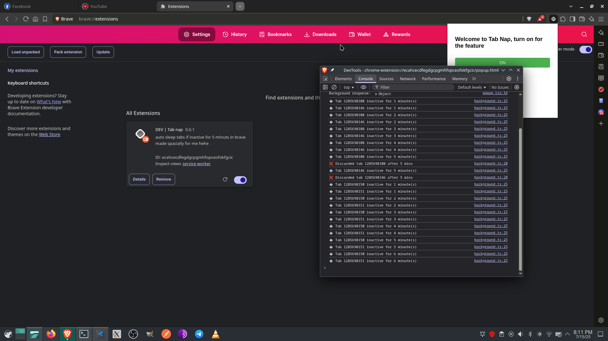

# 💤 tabNap (alpha)

**A browser extension for Chromium-based browsers.**
It puts inactive tabs to sleep (hybernates them) after **5 minutes** of inactivity to help save memory and boost performance.

> ⚠️ **Note:** tabNap is currently in **alpha** — it’s not fully functional yet and may not behave as expected.

## Preview

---

## 🚀 Features (Planned)

* Automatically hybernates tabs after 5 minutes of inactivity
* Lightweight memory-saving utility
* Runs silently in the background
* Customizable timeout settings *(coming soon)*

---

## 🧪 Status

This project is under active development.
Currently **not usable** — but feel free to explore or contribute.

---

## 📄 License

This project is licensed under the **[Tahsin Public License (TPL) v1.0](./LICENSE)**.
